# my-default-frontend-template
 
## let's create a vite app using typescript

```bash
npm create vite@latest
```
when creating the application.
we have to give the application name.
then we have to give the react as the frame work and typescript as the language.

## then we can add eslint to our application

```bash
npm init @eslint/config 
```

this will prompt to answer questions regarding your application.

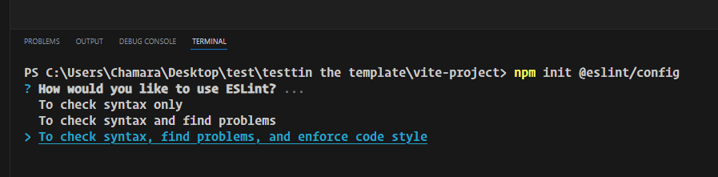
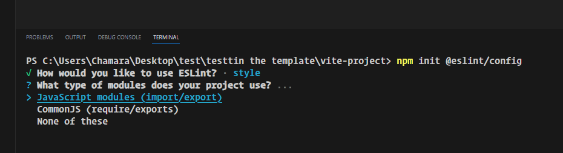
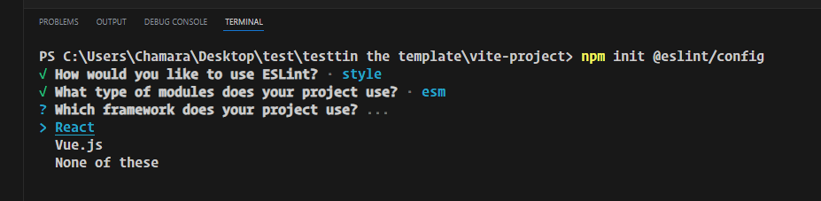
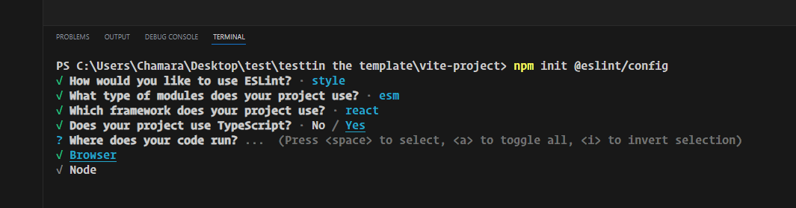
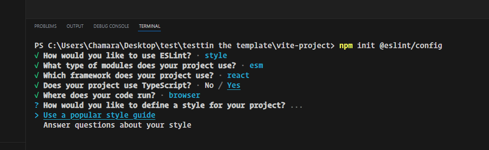
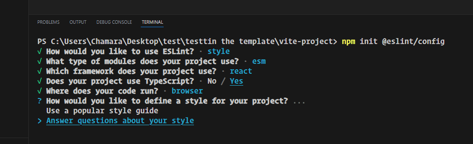
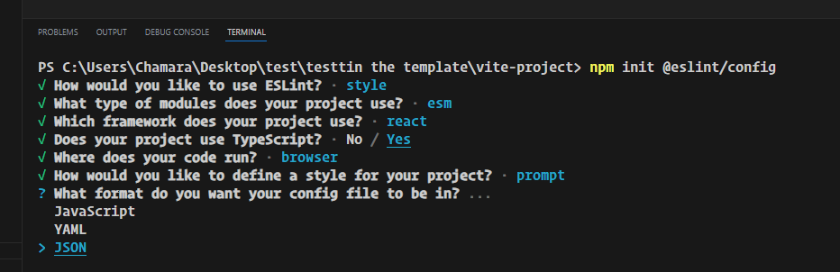
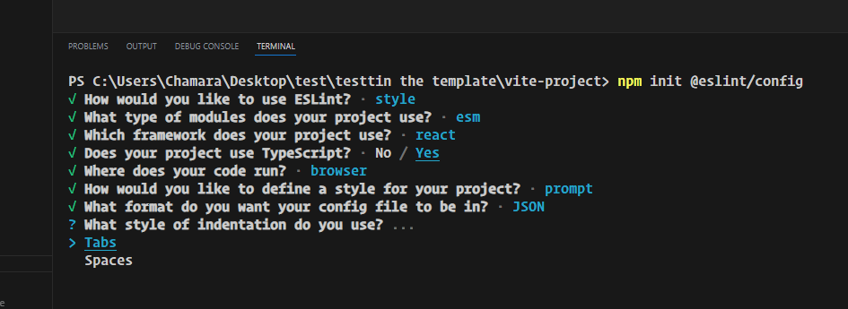
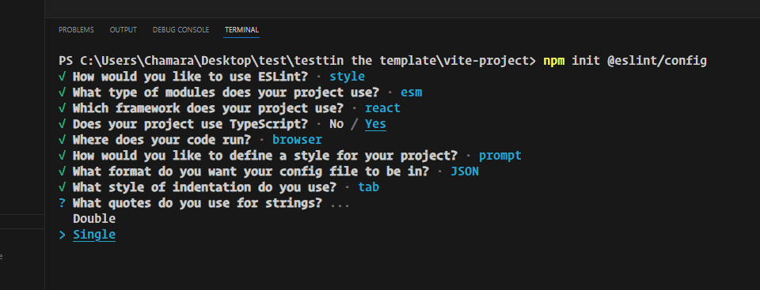
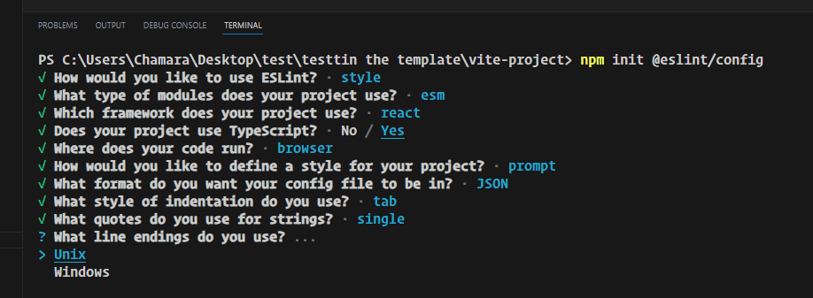
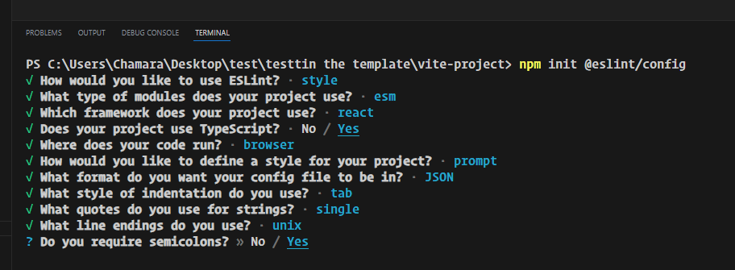
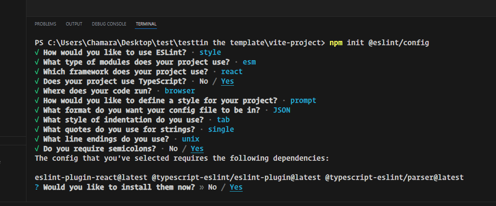
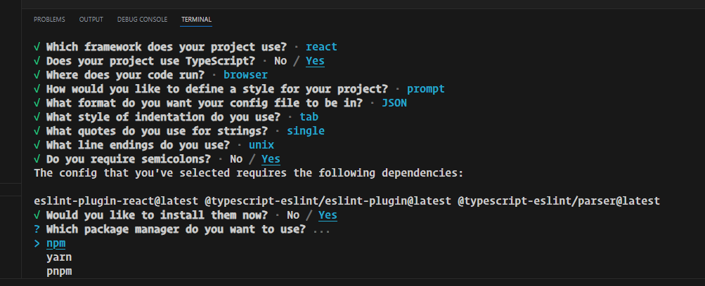
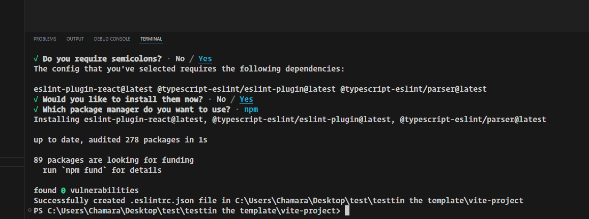

these dependencies are needed for the application.

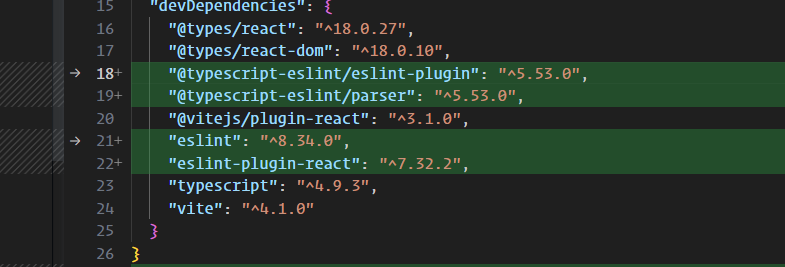

```bash
npm i -D @typescript-eslint/eslint-plugin @typescript-eslint/parser eslint eslint-plugin-react
```

this will generate the eslint config file

```json
{
    "env": {
        "browser": true,
        "es2021": true
    },
    "extends": [
        "eslint:recommended",
        "plugin:react/recommended",
        "plugin:@typescript-eslint/recommended"
    ],
    "overrides": [
    ],
    "parser": "@typescript-eslint/parser",
    "parserOptions": {
        "ecmaVersion": "latest",
        "sourceType": "module"
    },
    "plugins": [
        "react",
        "@typescript-eslint"
    ],
    "rules": {
        "indent": [
            "error",
            "tab"
        ],
        "linebreak-style": [
            "error",
            "unix"
        ],
        "quotes": [
            "error",
            "single"
        ],
        "semi": [
            "error",
            "always"
        ]
    }
}

```

now our application looks like this.

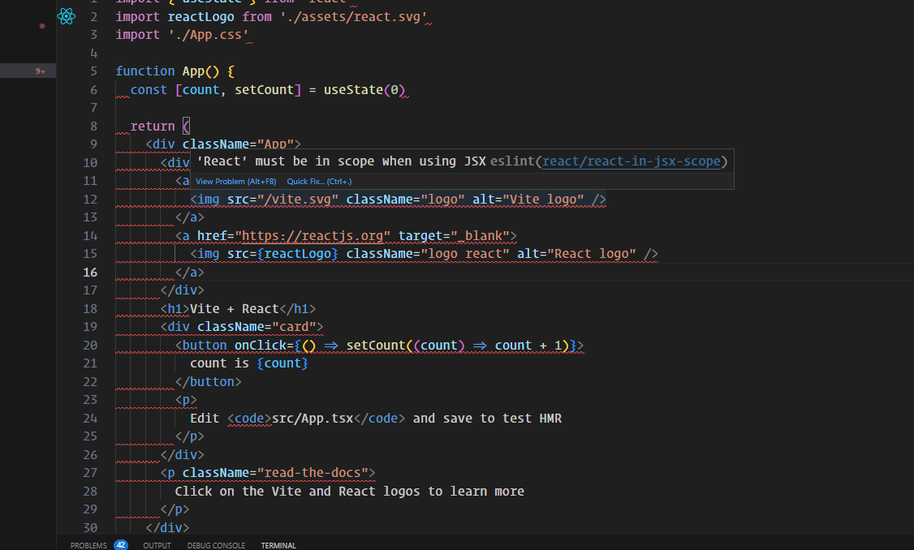

since we are using react 18 we do not need to add react to every component

so we will use this extension

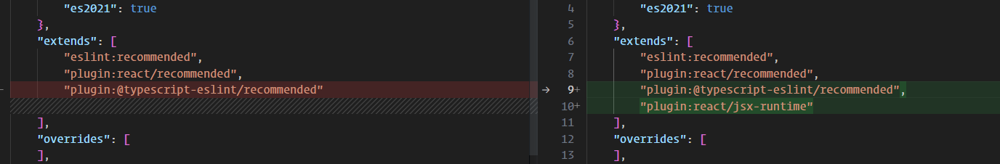

this will remove the react error.

to fix those issues we will run the linter \

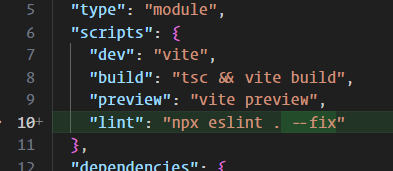

let's run this command

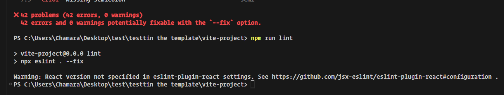

now we can see the result 

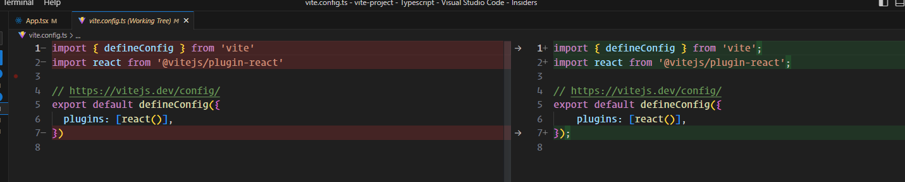
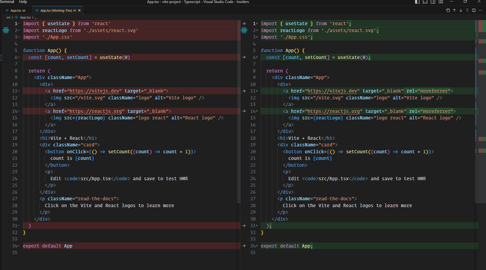
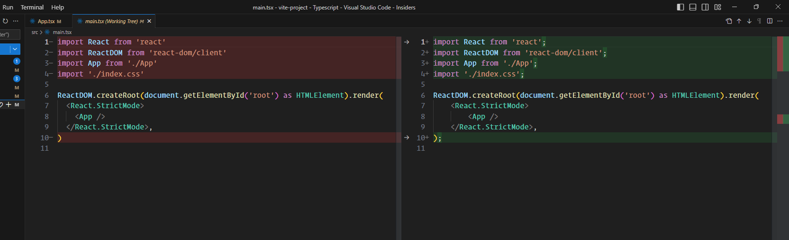


```json
{
    "env": {
        // browser means this app will run on the browser
		"browser": true,
        // this is the target js version
		"es2021": true
	},
	"extends": [
        // using the plugins we import in the plugins section
		"eslint:recommended",
        // this will add the recommended rules from the react plugin
		"plugin:react/recommended",
        // this will add the recommended rules from the react-hooks plugin
		"plugin:react-hooks/recommended",
        // this will add the recommended rules from the @typescript-eslint
		"plugin:@typescript-eslint/recommended",
        // this will disable conflicting eslint rules with prettier
		"prettier",
        // so we don't have to import react in every component
		"plugin:react/jsx-runtime"
	],
	"overrides": [],
    // this is used to parse typescript
	"parser": "@typescript-eslint/parser",
    // these are the options for the parsing
	"parserOptions": {
		"ecmaVersion": "latest",
		"sourceType": "module"
	},
    // these are the plugins we installed on our application.
    // @typescript-eslint -> @typescript-eslint/eslint-plugin
    // promise -> "eslint-plugin-promise": "^6.1.1",
	"plugins": ["@typescript-eslint", "promise"],
	"rules": {
        // this will throw an error when we use tabs for indentation.
        // use lf for the line break will fix the crlf files when we run the linter
		"linebreak-style": ["error", "unix"],
		/* this is related to promise" */
		"promise/always-return": "error",
		"promise/no-return-wrap": "error",
		"promise/param-names": "error",
		"promise/catch-or-return": "error",
		"promise/no-native": "off",
		"promise/no-nesting": "warn",
		"promise/no-promise-in-callback": "warn",
		"promise/no-callback-in-promise": "warn",
		"promise/avoid-new": "warn",
		"promise/no-new-statics": "error",
		"promise/no-return-in-finally": "warn",
		"promise/valid-params": "warn"
	},
	"settings": {
        // these are related to react eslint plugin
		"react": {
			"version": "18.2.0"
		}
	}
}

```

## eslint config dependencies

### [eslint-config-prettier](https://github.com/prettier/eslint-config-prettier/)
Turns off all rules that are unnecessary or might conflict with Prettier.
### [eslint-plugin-react](https://www.npmjs.com/package/eslint-plugin-react)

React specific linting rules for eslint