# my-default-frontend-template

## let's create a vite app using typescript

```bash
npm create vite@latest
```

when creating the application.
we have to give the application name.
then we have to give the React as the framework and typescript as the language.

## then we can add eslint to our application

```bash
npm init @eslint/config 
```

this will prompt to answer questions regarding your application.


these dependencies are needed for the application.


```bash
npm i -D @typescript-eslint/eslint-plugin @typescript-eslint/parser eslint eslint-plugin-react
```

this will generate the eslint config file

```json
{
  "env": {
    "browser": true,
    "es2021": true
  },
  "extends": [
    "eslint:recommended",
    "plugin:react/recommended",
    "plugin:@typescript-eslint/recommended"
  ],
  "overrides": [
  ],
  "parser": "@typescript-eslint/parser",
  "parserOptions": {
    "ecmaVersion": "latest",
    "sourceType": "module"
  },
  "plugins": [
    "react",
    "@typescript-eslint"
  ],
  "rules": {
    "indent": [
      "error",
      "tab"
    ],
    "linebreak-style": [
      "error",
      "unix"
    ],
    "quotes": [
      "error",
      "single"
    ],
    "semi": [
      "error",
      "always"
    ]
  }
}

```

now our application looks like this.


since we are using react 18 we do not need to add react to every component

so we will use this extension


this will remove the React error.

to fix those issues we will run the linter \


let's run this command


now we can see the result


since we are using react hooks let's add linting rules for then as well.

```bash
npm install eslint-plugin-react-hooks --save-dev
```

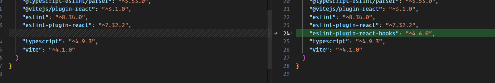

and this to extend.

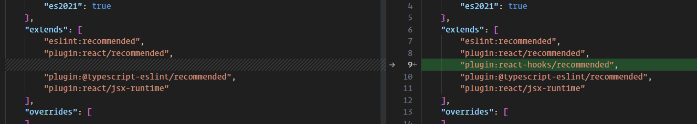

now let's add prettier

```bash
npm install --save-dev --save-exact prettier
```

then

```bash
echo {}> .prettierrc.json
echo {}> ..prettierignore
```

ESLint (and other linters)

If you use ESLint, install eslint-config-prettier to make ESLint and Prettier play nice with each other. It turns off
all ESLint rules that are unnecessary or might conflict with Prettier.

let's add `eslint-config-prettier`

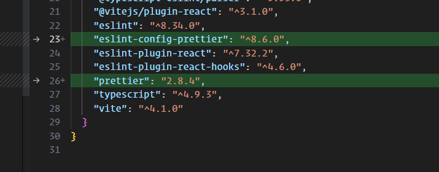

if you are using vscode

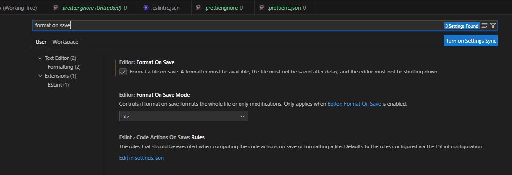

add the config

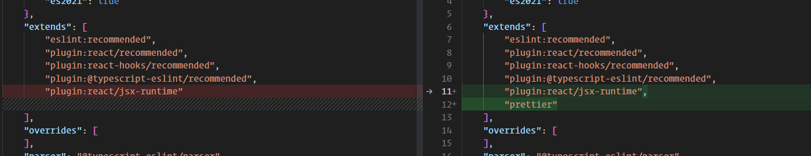

this sis the config

```json

{
  "arrowParens": "always",
  "singleQuote": true
}
```

let's integrate prettier to the eslint.

we will use `eslint-plugin-prettier `

Runs Prettier as an ESLint rule and reports differences as individual ESLint issues.

```bash
npm install --save-dev eslint-plugin-prettier
```

package updated

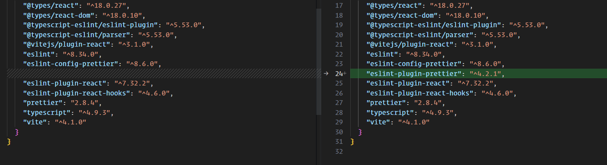

adding prettier rules

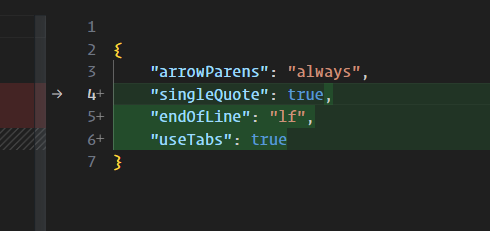

adding prettier config

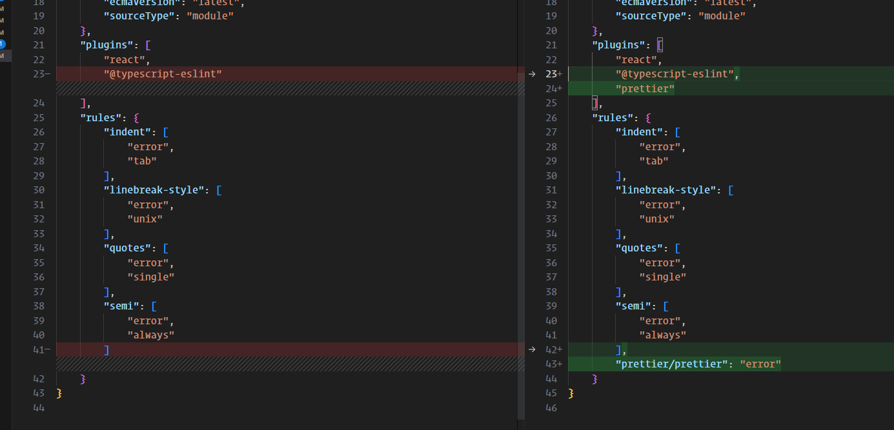

```json
{
  "env": {
    // browser means this app will run on the browser
    "browser": true,
    // this is the target js version
    "es2021": true
  },
  "extends": [
    // using the plugins we import in the plugins section
    "eslint:recommended",
    // this will add the recommended rules from the react plugin
    "plugin:react/recommended",
    // this will add the recommended rules from the react-hooks plugin
    "plugin:react-hooks/recommended",
    // this will add the recommended rules from the @typescript-eslint
    "plugin:@typescript-eslint/recommended",
    // add the prettier recommended setting
    "plugin:prettier/recommended",
    // so we don't have to import react in every component
    "plugin:react/jsx-runtime"
  ],
  "overrides": [],
  // this is used to parse typescript
  "parser": "@typescript-eslint/parser",
  // these are the options for the parsing
  "parserOptions": {
    "ecmaVersion": "latest",
    "sourceType": "module"
  },
  // these are the plugins we installed on our application.
  // @typescript-eslint -> @typescript-eslint/eslint-plugin
  // promise -> "eslint-plugin-promise": "^6.1.1",
  "plugins": [
    "react",
    "@typescript-eslint",
    "promise"
  ],
  "rules": {
    "prettier/prettier": [
      "error",
      {
        "singleQuote": true,
        "endOfLine": "lf",
        "semi": true,
        "useTabs": true,
        "bracketSpacing": true,
        "bracketSameLine": true
      }
    ]
    // this will throw an error when we use tabs for indentation.
    // use lf for the line break will fix the crlf files when we run the linter
    "linebreak-style": [
      "error",
      "unix"
    ],
    /* this is related to promise" */
    "promise/always-return": "error",
    "promise/no-return-wrap": "error",
    "promise/param-names": "error",
    "promise/catch-or-return": "error",
    "promise/no-native": "off",
    "promise/no-nesting": "warn",
    "promise/no-promise-in-callback": "warn",
    "promise/no-callback-in-promise": "warn",
    "promise/avoid-new": "warn",
    "promise/no-new-statics": "error",
    "promise/no-return-in-finally": "warn",
    "promise/valid-params": "warn"
  },
  "settings": {
    // these are related to react eslint plugin
    "react": {
      "version": "18.2.0"
    }
  }
}

```

## eslint config dependencies

### [eslint-config-prettier](https://github.com/prettier/eslint-config-prettier/)

Turns off all rules that are unnecessary or might conflict with Prettier.

### [eslint-plugin-react](https://www.npmjs.com/package/eslint-plugin-react)

React specific linting rules for eslint


<!-- not completed -->

## Adding lint-staged to lint our staged files.

first install

```bash
npm install --save-dev lint-staged
```

then create a config file. `.lintstagedrc.json`

```json
{
  "src/**/*.{ts,tsx}": "npm run lint",
  "src/**/*.{html,scss,css}": "prettier --write",
  "*.json": "prettier --write"
}
```

## Husky setup

```bash
npx husky-init && npm install
```

It will set up husky, modify package.json and create a sample pre-commit hook that you can edit. By default, it will run
npm test when you commit.
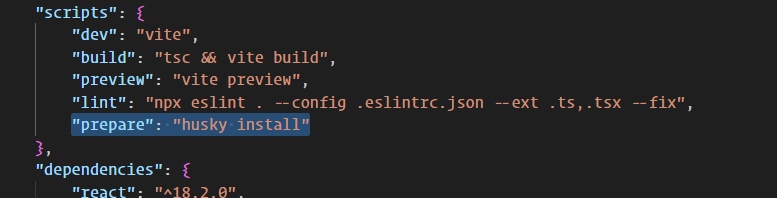

let's add our lint staged command to our pre commit hook.

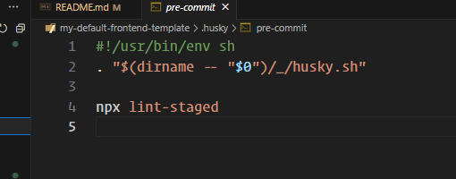

to add new hooks

```bash
npx husky add .husky/commit-msg 'npx --no -- commitlint --edit "$1"'
```

let's add commit lint to check our commit message.

let's install the dependencies.

```bash 
npm i -D @commitlint/cli @commitlint/config-conventional
```

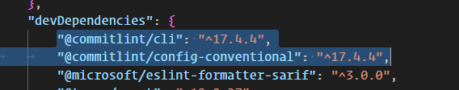

let's add the configuration file to the commitlintrc.json

```json
{
  "extends": [
    "@commitlint/config-conventional"
  ],
  "rules": {
    "header-max-length": [
      2,
      "always",
      50
    ]
  }
}
```

let's add this to our commit message hook
to add new hooks

```bash
npx husky add .husky/commit-msg 'npx --no -- commitlint --edit "$1"'
```

and change it to `prepare-commit-msg`

```sh
#!/usr/bin/env sh
. "$(dirname -- "$0")/_/husky.sh"

npx --no -- commitlint --edit $1 --color
```

let's add a protected branch as well.

```bash
npx husky add .husky/commit-msg 'npx --no -- commitlint --edit "$1"'
```

add this code

```json
#!/usr/bin/env sh
. "$(dirname -- "$0")/_/husky.sh"

BRANCH=$(git rev-parse --abbrev-ref HEAD)

if ["$BRANCH" = "main"]; then
echo "You are not allowed to commit changes directly to the development branch"
exit 1
fi
```

## Adding Redux Toolkit

### Installation

since we are using it with react

```shell
npm install @reduxjs/toolkit react-redux
```

and types for the React-redux library

```shell
npm i -D @types/react-redux
```


### let's create a simple counter slice.

```ts
import { createSlice, PayloadAction } from '@reduxjs/toolkit';

interface CounterState {
	value: number;
}

const initialState: CounterState = {
	value: 0,
};

const counterSlice = createSlice({
	name: 'counter',
	initialState,
	reducers: {
		increment(state) {
			state.value++;
		},
		decrement(state) {
			state.value--;
		},
		amountAdded(state, action: PayloadAction<number>) {
			state.value += action.payload;
		},
	},
});

export const { decrement, increment, amountAdded } = counterSlice.actions;

export default counterSlice.reducer;
```

we are importing createSlice which is the abstraction layer to plain redux

adding interface to the state

and adding the initial state.

then we are creating the slice.

1. inside we can add the initial state.
2. name of the slice
3. reducers

```ts
amountAdded(state, action
:
PayloadAction<number>
)
{
	state.value += action.payload;
}
,
```

here we have access to the local state and action.

from the slice we can export actions.

let's create another slice for the api slice

```ts
import { createApi, fetchBaseQuery } from '@reduxjs/toolkit/query/react';

const API_KEY =
	'live_kicdDGwE77g052Gkl9558mF31sFJpJhwlG6nUzbXsclXPPO3zDwCH7OKmVPXIy3Z';

interface Breed {
	id: string;
	name: string;
	image: {
		url: string;
	};
}

export const apiSlice = createApi({
	reducerPath: 'api',
	baseQuery: fetchBaseQuery({
		baseUrl: 'https://api.thedogapi.com/v1',
		prepareHeaders(headers) {
			headers.set('x-api-key', API_KEY);
			return headers;
		},
	}),
	endpoints(builder) {
		return {
			fetchBreed: builder.query<Breed[], number | void>({
				query(limit = 10) {
					return `/breeds?limit=${limit}`;
				},
			}),
		};
	},
});

export const { useFetchBreedQuery } = apiSlice;

```

### let's create the store

```ts
import { configureStore } from '@reduxjs/toolkit';
import counterReducer from '../features/counter/counter.slice';
import { apiSlice } from '../features/dogs-api/dogs.api.slice';

export const store = configureStore({
	reducer: {
		counter: counterReducer,
		[apiSlice.reducerPath]: apiSlice.reducer,
	},
	middleware: (getDefaultMiddleware) => {
		return getDefaultMiddleware().concat(apiSlice.middleware);
	},
});

export type AppDispatch = typeof store.dispatch;
export type RootState = ReturnType<typeof store.getState>;
```

### let's create the hooks to get the types

```ts
import { TypedUseSelectorHook, useDispatch, useSelector } from 'react-redux';
import { AppDispatch, RootState } from './store';

export const useAppDispatch = () => useDispatch<AppDispatch>();

export const useAppSelector: TypedUseSelectorHook<RootState> = useSelector;

```

### let's add the Provider

```tsx
import React from 'react';
import ReactDOM from 'react-dom/client';
import App from './App';
import './index.css';
import { Provider } from 'react-redux';
import { store } from './app/store';

ReactDOM.createRoot(document.getElementById('root') as HTMLElement).render(
	<Provider store={store}>
		<React.StrictMode>
			<App />
		</React.StrictMode>
	</Provider>
);
```

### let's use the api

```tsx
import { useState } from 'react';
import './App.css';
import { useFetchBreedQuery } from './features/dogs-api/dogs.api.slice';

function App() {
	const [selectedValue, setSelectedValue] = useState<number>(10);
	const { isFetching, data = [] } = useFetchBreedQuery(selectedValue);

	return (
		<div className="App">
			{isFetching && <div>Loading</div>}
			<div>
				<p>Number os Dogs fetched: {data.length}</p>
			</div>
			<div>
				<select
					value={selectedValue}
					onChange={(e) => setSelectedValue(+e.target.value)}>
					<option value="5">5</option>
					<option value="10">10</option>
					<option value="20">20</option>
					<option value="30">30</option>
				</select>
			</div>
			<table>
				<thead>
				<tr>
					<td>id</td>
					<td>name</td>
					<td>image</td>
				</tr>
				</thead>
				<tbody>
				{data.map((dog) => (
					<tr key={dog.id}>
						<td>{dog.id}</td>
						<td>{dog.name}</td>
						<td>
							
						</td>
					</tr>
				))}
				</tbody>
			</table>
			{/* <h1>value</h1>
			<h1>{value}</h1>
			<button onClick={() => dispatch(amountAdded(12))}>increment</button> */}
		</div>
	);
}

export default App;

```